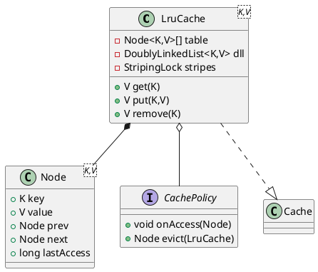

# LRU Cache – Low-Level Design (LLD)

> Part 1 • **Core Data-Structures & APIs** • _Author: Anupam Kumar_

_This series drills down from the HLD into concrete classes, methods and algorithms.  
Part 1 covers the core LRU engine. Subsequent parts will describe decorators (TTL, metrics, persistence), sharding, and testing._

---

## 1 Package Structure
```
lld.implement.cache
├─ api         (public facing contracts)      ↗ module `cache-api`
├─ core        (striped-lock LRU engine)      ↗ module `cache-core`
└─ internal    (utility, e.g. Striping)       ↗ automatic-module   
```

*Only classes in `api` are exported by JPMS; `core` is open for reflective access in tests only.*

## 2 Public API (cache-api)
```java
package lld.implement.cache;

public interface Cache<K,V> extends AutoCloseable {
    V get(K key);
    V put(K key, V value);              // returns previous value
    V remove(K key);
    boolean containsKey(K key);
    long size();                        // snapshot, not linearizable

    // bulk helpers
    default void putAll(Map<K,V> m) { m.forEach(this::put); }

    // builder entry-point
    static <K,V> CacheBuilder<K,V> builder() { return new CacheBuilder<>(); }
}
```

### 2.1 Builder (fluent, validates config)
```java
public final class CacheBuilder<K,V> {
    public CacheBuilder<K,V> capacity(int maxSize);      // required
    public CacheBuilder<K,V> policy(CachePolicy p);      // default LRU
    public CacheBuilder<K,V> stripes(int n);             // default = cores×2
    public CacheBuilder<K,V> clock(Clock c);             // inject for testability
    public Cache<K,V> build();
}
```

## 3 Core Engine (cache-core)

### 3.1 Class Diagram (PlantUML)


### 3.2 Node
```java
final class Node<K,V> {
    final K key;
    volatile V value;
    Node<K,V> prev;
    Node<K,V> next;
    volatile long lastAccess;   // updated on read; aids TTL module later
}
```
*Immutability for `key`; `value` is volatile to avoid full lock when only reading.*

### 3.3 Striped Locking
```java
final class StripedLock {
    private final ReentrantLock[] locks;
    ReentrantLock lockFor(Object key) {
        int idx = (key.hashCode() & 0x7fffffff) % locks.length;
        return locks[idx];
    }
}
```
*`locks.length` defaults to `Math.max(2, Runtime.getRuntime().availableProcessors() * 2)`.*

### 3.4 Doubly-Linked List
*Single intrusive list shared by all stripes; mutations performed only by holding the stripe lock that owns the node.*

| Operation | Complexity | Notes |
|-----------|------------|-------|
| `addFirst(Node)` | O(1) | Promotes MRU |
| `remove(Node)`   | O(1) | Pointer surgery |
| `removeTail()`   | O(1) | Returns LRU for eviction |

### 3.5 `get` Slow Path – Pseudocode
```java
V get(K key) {
    int h = hash(key);
    Lock l = stripes.lockFor(key);
    l.lock();
    try {
        Node n = map.get(key);
        if (n == null) return null;
        dll.moveToHead(n);          // maintains recency
        return n.value;
    } finally {
        l.unlock();
    }
}
```

### 3.6 `put` Path – Pseudocode
```java
V put(K key, V value) {
    Lock l = stripes.lockFor(key);
    l.lock();
    try {
        Node n = map.get(key);
        if (n != null) {
            V old = n.value;
            n.value = value;
            dll.moveToHead(n);
            return old;
        }
        if (map.size() >= capacity) {
            Node evict = dll.removeTail();
            map.remove(evict.key);
            policy.onEvict(evict);
        }
        Node<K,V> fresh = new Node<>(key, value);
        map.put(key, fresh);
        dll.addFirst(fresh);
        return null;
    } finally { l.unlock(); }
}
```

*Linearization point located within same critical section where map & DLL are consistent.*

### 3.7 Error Handling
* Null key/value → `IllegalArgumentException` checked in builder.
* Capacity overflow impossible by invariant (eviction before insert under lock).

## 4 Unit-Test Strategy
| Layer | Tool | Focus |
|-------|------|-------|
| Core  | JUnit5 | CRUD behaviour, eviction correctness |
| Concurrency | JCStress | Safety & linearizability |
| Performance | JMH | Baseline throughput/latency |

## 5 Next Parts
1. **Part 2 – Decorators & Policies** (TTL, Metrics, Persistence)  
2. **Part 3 – Sharding & Distributed Extensions**  
3. **Part 4 – Test Harness & CI integration**

---
© 2025 – Internal Use Only
