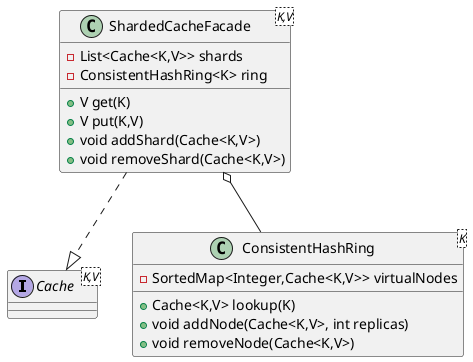

# LRU Cache – Low-Level Design (LLD)

> Part 3 • **Sharding & Distributed Extensions** • _Author: Anupam Kumar_

> Builds on **Part 1 (Core)** and **Part 2 (Decorators/Policies)**. Outlines how to horizontally scale the cache via in-process sharding and optional remote shards.

---

## 1 Motivation
* Core LRU scales to ~1 M entries per JVM before GC and lock contention start to rise.
* Many applications need tens of millions of keys but still prefer in-proc speed.
* Sharding splits the key-space across *N* independent cache instances, each far smaller, yielding near-linear throughput while bounding per-shard memory and lock scope.

## 2 Design Goals
| Goal | Description |
|------|-------------|
| Transparency | Client calls remain `cache.get(key)` – sharding hidden behind facade. |
| Elasticity | Ability to add/remove shards at runtime with minimal disruption. |
| Locality | Default shards live in same JVM; future option for remote shards. |
| Low Overhead | Extra hash + delegate call only; ≤ 50 ns added latency. |
| Consistency | Shard boundaries determined by **consistent hashing** to minimise re-map churn. |

## 3 Class Diagram (UML excerpt)

## 4 Consistent Hash Ring
* Uses Murmur3 128-bit → int32 for speed; virtual nodes (`replicas=128`) for uniformity.
* `lookup(key)` → first node at or after hash; wrap-around at end of ring.
* Thread-safe via `ReadWriteLock` to allow fast lookups and rare ring mutations (`addShard`).

## 5 ShardedCacheFacade Operations
| Method | Flow |
|--------|------|
| `get`  | `shard = ring.lookup(key)` → `shard.get(key)` |
| `put`  | same as `get`; eviction local to shard |
| `remove` | delegate |
| `size` | aggregate of `shard.size()` (weakly consistent) |

*Facade is stateless; failures isolated to single shard.*

## 6 Dynamic Shard Addition
1. New `Cache` instance created via builder (could be remote proxy).
2. `addShard(newShard)` – acquires ring write-lock, inserts node + replicas.
3. **Rebalancing:** _best-effort evacuation_
   * Enumerate keys from victim shards that now map to `newShard` (`foreach key` snapshot + `remove`+`put`).
   * Evacuation runs in background; lookups consult ring so consistency eventually achieved.
4. Removal symmetric (`removeShard`). Optional *drain* to external store before shutdown.

## 7 Remote Shard Extension (Future)
| Component | Responsibility |
|-----------|---------------|
| `RemoteCacheShardClient` | gRPC/HTTP client implementing `Cache<K,V>`; marshals calls. |
| `CacheShardServer` | Stand-alone service exposing same API backed by core LRU. |
| **Failure Handling** | Circuit-breaker around client; fallback to local shard if configured. |

All transports hidden behind same interface; JD-kG RPC chosen for low overhead.

## 8 Threading & Performance
* Hash lookup cost ≈ 30 ns (Murmur3) + virtual-node binary search.
* Shards operate independently; overall throughput ≈ `sum(shard_throughput)`.
* CPU utilisation: ring lookup is pure CPU; no locks except read-lock which is uncontended.
* Memory: ring overhead = `replicas × shards × 16 B` (hash + reference).

## 9 Observability
* `ShardedCacheFacade` exposes Metrics gauge `cache.shards` and counter `cache.rebalanced`.
* Ring mutation events logged at INFO.

## 10 Testing Plan
| Type | Tool | Scenario |
|------|------|----------|
| Unit | JUnit5 | lookup correctness w/ virtual nodes |
| Concurrency | JCStress | simultaneous `addShard` + `get` safety |
| Performance | JMH | throughput scale vs shard count |
| Rebalance | Integration | inject 4→8 shards; verify <10 % keys remapped |

## 11 Open Points
* Hot-key migration / replication (may replicate popular keys to multiple shards).
* Distributed eviction stats aggregation.
* TLS + Auth for remote shard gRPC.

---
_End of Part 3 – Subsequent LLD parts will focus on Testing/CI & Security hardening._
